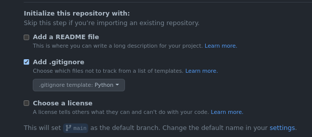
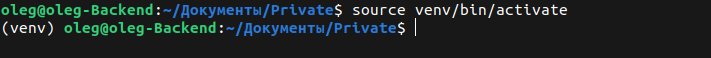

В первом ДЗ тебе предстоит познакомиться с фреймфорком Django.

## Создание репозитория на github
Для начала создай публичный репозиторий на github для своего будущего проекта.
Не забудь сразу добавить gitignore, во время создания репозитория. Просто установи соответствующую галочку и выбери пункт Python.
 

Склонируй созданный репозиторий себе на компьютер, куда удобно.

## requirements.txt
Для дальнейшей разработки, а в будущем удобного развертывания проекта на сервере или хостинге, тебе нужно создать файл requirements.txt. Этот файл будет содержать все зависимости которые нужны для работы твоего проекта.
Перейди в папку репозитория и создай там файл requirements.txt . открой этот файл и добавь туда строчку Django(да, просто напиши слово Django, сохрани и закрой файл), в дальнейшем этот файл будет дополняться новыми зависимостями, на данном этапе достаточно одной)
Дополнительно про requirements.txt можно прочитать по [ссылке](https://pip.pypa.io/en/latest/user_guide/#requirements-files)

## Создание виртуального окружения
Для удобства разработки необходимо создать виртуальное окружение. Про виртуальное окружение можно почитать [здесь](https://devpractice.ru/python-lesson-17-virtual-envs/)
Открой консоль в папке репозитория и введи следующую команду для создания вирт. окружения.

Для Windows

Для Linux

После выполнения команды в этой папке должна создаться папка venv.

## Активация виртуального окружения и установка зависимостей
Все готово для установки Django. Активируй виртуальное окружение командой

Для Windows

Для Linux

После активации окружения в строке терминала должна появится пометка (venv)

Устанавливаем Django. для этого нужно ввести команду 

тем самым мы установим все зависимости прописанные в файле requirements.txt

## Создаем и запускаем первый проект

После установки Django, выполни команду 

Эта команда создаст базовую структуру проекта Django. Должна появится папка с названием проекта. Описание всего этого вы узнаете в лекции.

## Задание домой
Посмотри лекцию и вспомни как запускать дев. сервер проекта. Проверь все ли ты сделал так как нужно. Если все сделано правильно при переходе по ссылке которая будет доступна после запуска дев. сервера ты должен увидеть такую главную страницу.

Далее нужно будет создать первое приложение в проекте командой 

Более подробно описано в лекции.

Создай свою первую view для главной страницы в свое приложении и выведи на эту страницу текст - "Главная страница". Зарегистрируй view в urls. Перезапусти дев.сервер и попробуй перейти на главную страницу. 

### Для первого ДЗ этого будет достаточно)